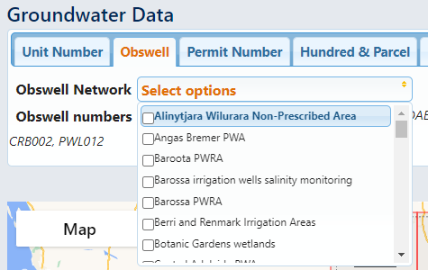

Background information
========================

.. contents:: :local:

This package facilitates access to data from a variety of sources, which
are explained in the data dictionary on the next page. Before getting to
that there are some common terms which it would help to explain first.

Drillhole/well identifiers
~~~~~~~~~~~~~~~~~~~~~~~~~~

This package provides access to a wide variety of information for drillholes
or water wells located in South Australia. The fundamental piece of data to
understand is the drillhole, which represents either a mineral or petroleum 
exploration drillhole, petroleum production well, or a water well 
(could be a monitoring well or a production well -- from
a data point of view it doesn't matter much). I'll use the language
"drillhole" and "well" largely interchangeably from here on, as this is focused
only on the data point of view.

.. _drillhole-number:

Drillhole number
----------------

Drillholes are uniquely identified by this. It is 
strictly an integer which ranges from one up to six digits. e.g. 53925. 
Note that it forms part of the unique URL to both Groundwater Data:

https://www.waterconnect.sa.gov.au/Systems/GD/Pages/Details.aspx?DHNO=53925
  
and to the SARIG drillhole database:

https://minerals.sarig.sa.gov.au/Details.aspx?DRILLHOLE_NO=53925

.. _unit-number:

Unit number
----------- 

This is a set of two numbers: a four digit mapsheet number
e.g. 6628, and an integer as sequence number, e.g. 6956. The mapsheet and
sequence numbers, when presented together, form a "unit number". The mapsheet
refers to the 1:100K topographic series 
(see `Geoscience Australia webmap <https://geoscience-au.maps.arcgis.com/apps/dashboards/5908193d3a834e35bb8fbff0e252c08b>`_ 
showing each mapsheet's extent).

It can be 
presented in a variety of different formats e.g. "6628-6956" (the most common),
"662806956" (an integer representation formed by padding the sequence to
five digits) and "6628-06956" (seen in contexts relating to water licensing).

Unit numbers are available for all drillholes visible on Groundwater Data.
Although they are generally used only for water wells, they do exist for 
all wells. 

.. _obswell-number:  

Observation well ID  
-------------------

Also known as **obswell number** or **obsnumber**, this is a similar  concept
to the unit number, but utilises abbreviated observation well hundreds instead of
1:100K mapsheet numbers. The observation well hundreds are based on 
the cadastral hundreds 
(see `Location SA webmap <https://location.sa.gov.au/viewer/?map=hybrid&x=137.11107&y=-34.68218&z=7&uids=8>`_ 
for the extent of all hundreds),
though they are not identical. E.g. "YAT" is used for many wells in the inner
north of Adelaide - the abbreviation refers to the hundred of Yatala.

The second part of the ID is a sequence number e.g. 27. It is NOT the same as 
the sequence number used for the unit number, but is just within the observation
well hundred.

The two are then presented together in a variety of formats: 
"YAT027", "YAT27", "YAT 27", and so on.

The obsnumber stems from the historical use of a different database for water well
monitoring data, now discontinued. Obswell numbers are manually assigned, and
are not available for all wells, not even all water monitoring wells. The
presence of an obswell number also doesn't mean that a well is or was necessarily a monitoring well,
maybe just that it was intended to be once upon a time (could be many decades ago).

Multiple completions
--------------------

A drillhole is one bore, so in situations where there are multiple bores connected
together (e.g. a multi-tail exploration or petroleum well) or located together
(a clustered piezometer), there will be multiple drillholes to represent each
bore. Unfortunately the database doesn't link these together (!) other than 
that they are likely to have exactly the same spatial coordinates.

Spatial groupings
~~~~~~~~~~~~~~~~~~~

Groundwater is managed in SA in a variety of ways, and particularly depending on
the location of wells or users. Some of these spatial areas are 
available as attributes on wells through Groundwater Data:

- **Landscape region** / **Natural resource management (NRM) region** 
  These are large-scale areas which have responsibility for management of 
  water resources - see `Landscape SA <https://www.landscape.sa.gov.au/>`__ for
  more information.

- **Prescribed well area** (PWA) - these are smaller scale areas which are
  used to manage groundwater resources via a water allocation plans (WAP). 
  You can see all of the PWAs in SA on 
  `Location SA <https://location.sa.gov.au/viewer/?map=hybrid&x=142.06629&y=-31.83374&z=6&uids=156>`__.

- **Prescribed water resource area** (PWRA) - similar to a PWA, but they
  are used for both groundwater and surface water resources. To see all of the
  PWRAs in SA visit `Location SA <https://location.sa.gov.au/viewer/?map=hybrid&x=140.33869&y=-34.35527&z=8&uids=154>`__.

- **Observation well network** - these are not defined spatially. They are
  manually maintained lists of monitoring wells which DEW visits
  each year to measure water level and/or salinity. They generally correspond
  to a geographical area. You can get a dictionary showing the network code and name using 
  ``sa_gwdata.get_networks()`` or you can see a list on the Groundwater Data
  website:

.. |br| raw:: html

    