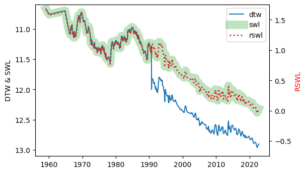

.. _data-fields-groundwater-level:

Data fields: groundwater level 
~~~~~~~~~~~~~~~~~~~~~~~~~~~~~~~~

Groundwater level observations made manually with a dipping tape are available. The frequency of observations
varies from monthly to once every six months, with significant missing periods across different drillholes
depending on the monitoring requirements. 

There are three different datums in which groundwater level data is
available. This figure shows how they inter-relate:

.. index:: Depth to Water (DTW)
   :name: depth-to-water

Automated groundwater level measurements are available for some monitoring wells on the
`Aquarius Web Portal at Water Data SA <https://water.data.sa.gov.au/Data/List/Parameter/SWL/Statistic/LATEST/Interval/Latest>`_. 
These measurements are not available through Groundwater Data.

.. START -- If you edit this text, please also edit the text on available-data.md 

Depth to Water (DTW)
------------------------
This is the depth to water level in metres measured below a reference point. Increasing numbers indicate an increasing depth to
water. Negative numbers indicate flowing artesian conditions. The reference point's true elevation above
ground surface *can* change i.e. if a casing standpipe is installed, removed, or modified, so although this number is
the "raw measurement" it should generally not be used for analysis. 

.. warning:: Do not use Depth to Water for analysis.

.. index:: Standing Water Level (SWL)
   :name: standing-water-level

Standing Water Level (SWL)
---------------------------
This is the Depth to Water, automatically corrected such that it represents a depth below ground level.
Increasing numbers indicate an increasing depth to water. Negative numbers indicate flowing artesian
conditions. The SWL and DTW values are only different when well elevation data is available and the two
elevation values (of the reference point, and the ground) are different - the difference is used to calculate
the SWL. If they are the same (e.g. maybe the elevation was derived from a digital elevation model), or no
elevation data is available, then the SWL will be present but it will be identical to the DTW.

.. note:: Use Standing Water Level for all trend or status analysis of data from individual wells.

.. index:: Reduced Standing Water Level (RSWL)
   :name: reduced-standing-water-level

Reduced Standing Water Level (RSWL)
----------------------------------------
This value has been corrected to represent the groundwater level measured above Australian Height Datum (AHD).
Increasing numbers indicate a *decreasing* depth to water. RSWL values are only present when we have an
elevation survey for that well. This is obviously the correct value to use for most purposes, if it is
available.

.. note:: Use Reduced Standing Water Level for all analysis of data between wells i.e. groundwater flow
   analysis.

.. END

----

.. _groundwater-level-fields:

Fields and field names are listed below for: the CSV file obtainable from Groundwater Data; the JSON returned
by :ref:`GetWaterLevelDetails`; and the pandas DataFrame returned by :meth:`sa_gwdata.water_levels`. A dash
indicates the field is missing.

.. csv-table::
  :file: data-types/groundwater-level.csv
  :header-rows: 1
  :widths: 20 35 15 15 15