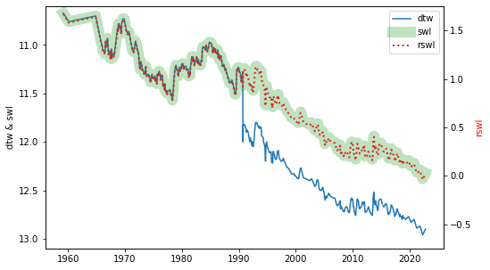

Available data types on Groundwater Data (GD)
=============================================

.. _groundwater-level:

Groundwater level
~~~~~~~~~~~~~~~~~~~

Groundwater level observations made manually with a dipping tape are available. The frequency of observations
varies from monthly to once every six months, with significant missing periods across different drillholes
depending on the monitoring requirements. There are three different datums in which groundwater level data is
available. This figure shows how they inter-relate:

.. index:: Depth to Water (DTW)
   :name: depth-to-water

.. START -- If you edit this text, please also edit the text on available-data.md 

Depth to Water (DTW)
------------------------
This is in metres measured below a reference point. Increasing numbers indicate an increasing depth to
water. Negative numbers indicate flowing artesian conditions. The reference point's true elevation above
ground surface *can* change i.e. if a casing standpipe is chopped off or installed, so although this number is
what is in effect measured in the real world, it should not be used for analysis. 

.. index:: Standing Water Level (SWL)
   :name: standing-water-level

Standing Water Level (SWL)
---------------------------
This is the Depth to Water, automatically corrected such that it represents a depth below ground level.
Increasing numbers indicate an increasing depth to water. Negative numbers indicate flowing artesian
conditions. The SWL and DTW values are only different when well elevation data is available and the two
elevation values (of the reference point, and the ground) are different - the difference is used to calculate
the SWL. If they are the same (e.g. maybe the elevation was derived from a digital elevation model), or no
elevation data is available, then the SWL will be present but it will be identical to the DTW. I recommend
that you always use the SWL value (or RSWL, see below).

.. index:: Reduced Standing Water Level (RSWL)
   :name: reduced-standing-water-level

Reduced Standing Water Level (RSWL)
----------------------------------------
This value has been corrected to represent the groundwater level measured above Australian Height Datum (AHD).
Increasing numbers indicate a *decreasing* depth to water. RSWL values are only present when we have an
elevation survey for that well. This is obviously the correct value to use for most purposes, if it is
available.

.. END

----

.. _groundwater-level-fields:

Fields and field names are listed below for: the CSV file obtainable from Groundwater Data; the JSON returned
by :ref:`GetWaterLevelDetails`; and the pandas DataFrame returned by :meth:`sa_gwdata.water_levels`. A dash
indicates the field is missing.

.. csv-table::
  :file: data-types/groundwater-level.csv
  :header-rows: 1
  :widths: 20 35 15 15 15

Salinity samples
~~~~~~~~~~~~~~~~~~~

These are water samples collected from wells, usually by pumping
deliberately for monitoring (or sampled from an irrigation pump), and
the salinity estimated by measuring the electrical conductivity (EC)

See the :ref:`water monitoring data tutorial <tutorial-water-monitoring-data>`
for more details.

Driller's logs
~~~~~~~~~~~~~~~

Lithological logs
~~~~~~~~~~~~~~~~~~~

Stratigraphic logs
~~~~~~~~~~~~~~~~~~~~

Hydrostratigraphic logs
~~~~~~~~~~~~~~~~~~~~~~~~

Drilled intervals
~~~~~~~~~~~~~~~~~~

Casing intervals and cementing information
~~~~~~~~~~~~~~~~~~~~~~~~~~~~~~~~~~~~~~~~~~
Contains details of the casing installed in a well - includes
some limited information about the annular grout. Note that production
zone data is not stored alongside casing data

Production zones
~~~~~~~~~~~~~~~~~~~
Details of the production zone interval of a well e.g. screens, slotted sections, blank sections in screens,
open hole intervals, and riser pipes. The types of intervals that are recorded in this table are:

.. _production-zone-interval:
.. list-table::
   :header-rows: 1
   :widths: 10 90

   * - Type
     - Description
   * - OH
     - Open hole interval. 
   * - S / WS 
     - Screen. Although 'WS' originally indicated wirewound screen, many/most of the entries
       with 'S' are indeed for wirewound screens.
   * - SB
     - Blank section of pipe between screened intervals
   * - SMP
     - Sump
   * - SC
     - Slotted casing interval
   * - PC
     - Perforated casing interval
   * - UKN
     - Unknown interval

.. warning:: Some depth entries in this table may not always be consistent with the :ref:`drilled intervals <drilled-intervals>` table above.

.. _production-zone-fields:

Fields and field names are listed below for: the CSV file obtainable from Groundwater Data; the JSON returned
by :ref:`GetProductionZoneSummary`; and the pandas DataFrame returned under the key ``"prod_zones"`` from
:meth:`sa_gwdata.construction_details`. 

.. csv-table::
  :file: data-types/production-zone.csv
  :header-rows: 1
  :widths: 20 35 15 15 15

Water cuts (groundwater observations during drilling)
~~~~~~~~~~~~~~~~~~~~~~~~~~~~~~~~~~~~~~~~~~~~~~~~~~~~~~
Observations of groundwater level, salinity and yield made at the time of drilling; generally historical and
collected during cable tool drilling.

Wellhead elevation surveys
~~~~~~~~~~~~~~~~~~~~~~~~~~~
Generally water monitoring wells are surveyed specifically for their elevation, and the data are kept here.
The data are also arranged by time such that changes in the reference point for groundwater level measurements
can be fully corrected to have a consistent and accurate measurement of groundwater level over the well's
life.

Water chemistry analyses
~~~~~~~~~~~~~~~~~~~~~~~~
